# Proyecto-Gestion-de-Libros
Repositorio que contiene la parte del back del equipo encargado de la gestión de libros del proyecto "Bibliosoft" el cual es un gestor de biblioteca para el colegio Nuestra Señora de la Sabiduría

Se crea el scaffolding del proyecto Library de la siguiente forma: 
```
Library/
├── src/
│   ├── main/
│   │   ├── java/
│   │   │   └── edu/
│   │   │       └── eci/
│   │   │           └── cvds/
│   │   │               ├── LibraryApplication.java
│   │   │               ├── controller/
│   │   │               │   └── LibroController.java
│   │   │               ├── model/
│   │   │               │   └── Ejemplar.java
|   |   |               |   └── Libro.java
│   │   │               ├── repository/
│   │   │               │   └── EjemplarRepository.java
|   |   |               |   └── LibroRepository.java
│   │   │               └── service/
│   │   │                   └── LibroService.java
│   │   └── resources/
│   │       ├── application.properties
└── pom.xml
```

## Creación de la clase libro 📚
Se crea la clase de libro, la cual tiene como atributos los definidos en la propuesta y adicionalmente tendrá una referencia a los ejemplares en otra coleccion de MongoDB

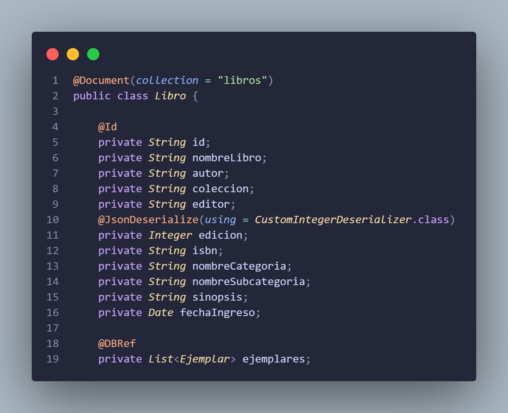 

## Configuración EndPoints básicos
Se crearon los endpoint básicos para crear, actualizar, eliminar y consultar libros

- Solicitud POST
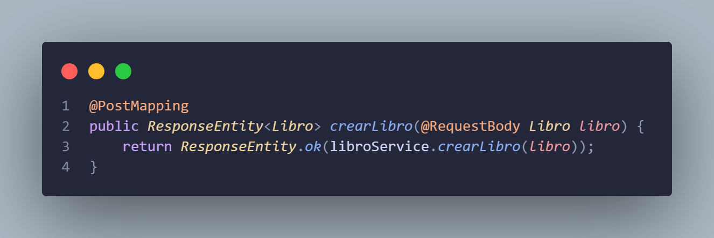
    - Prueba de la solicitud POST
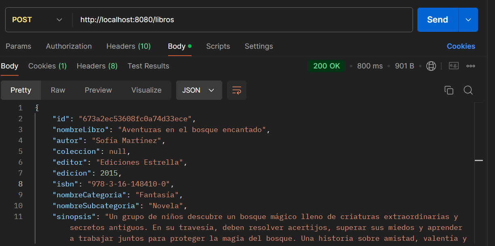


- Solicitud GET
  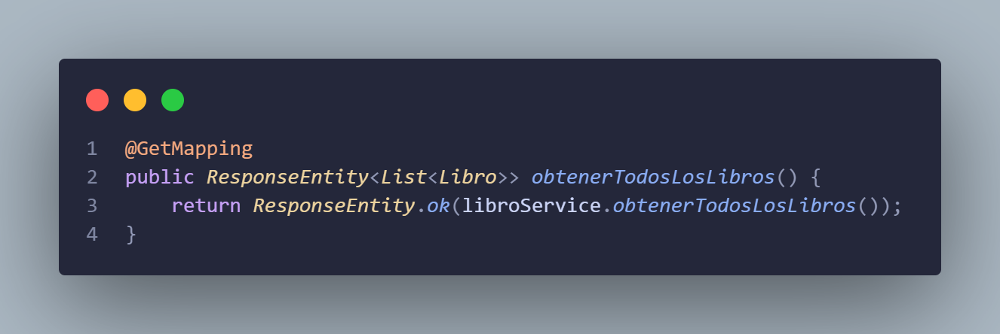
  - Prueba de la solicitud GET
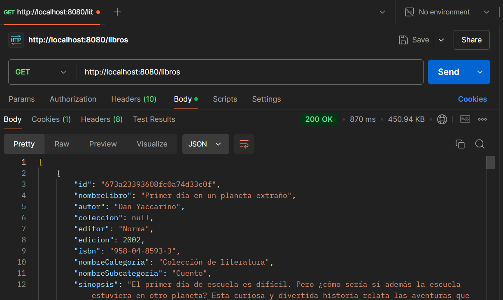


- Solicitud PUT
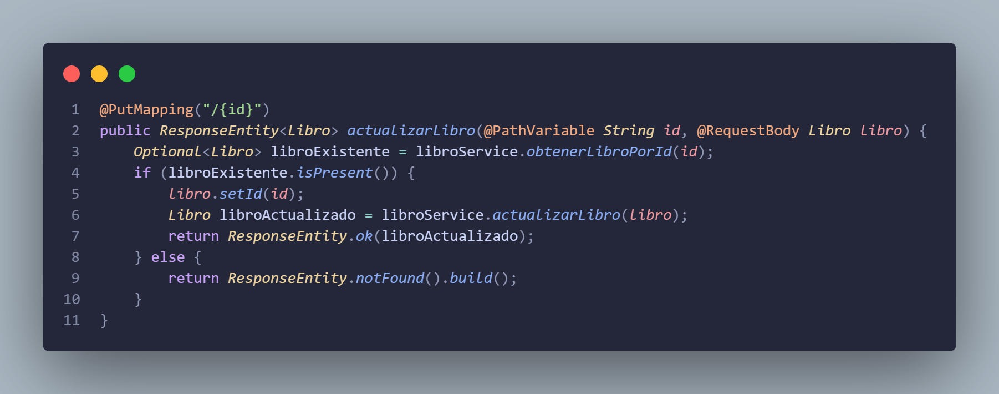
  - Prueba de la solicitud PUT
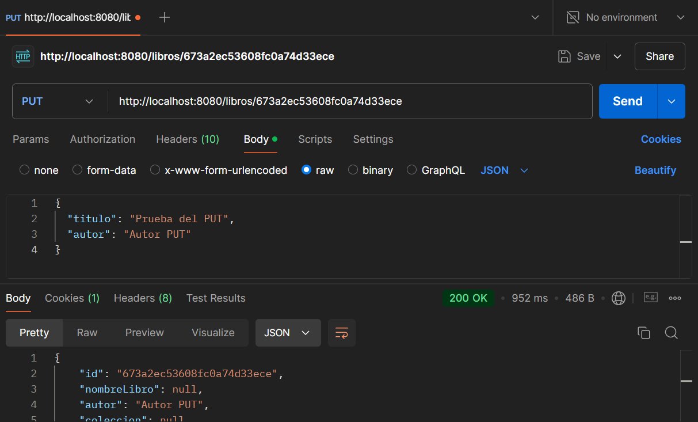


- Solicitud DELETE
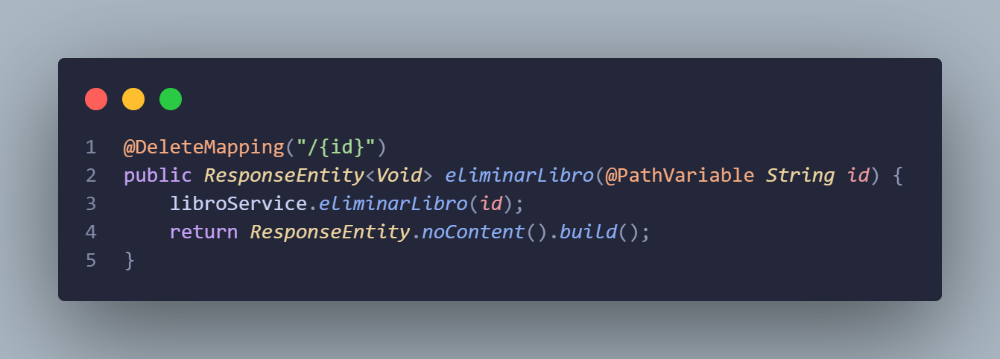
  - Prueba de la solicitud DELETE
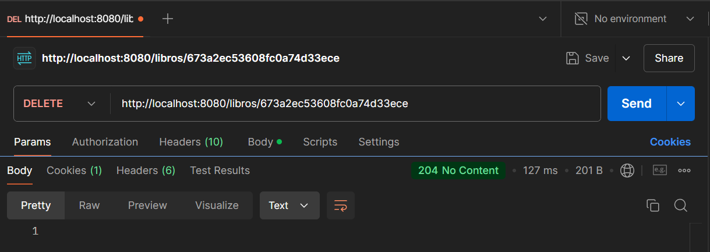


## Importación de datos mediante python 👾
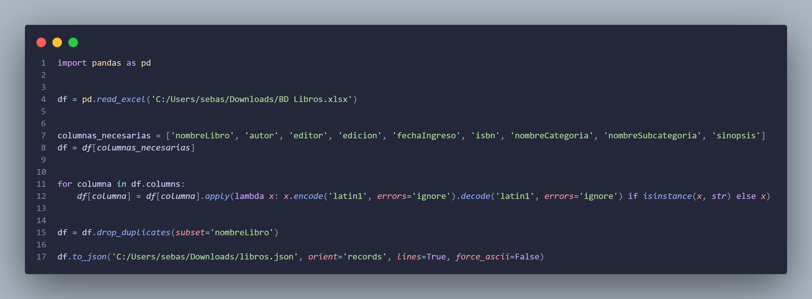
El siguiente codigo fué usado para importar los datos que nos fueron otorgados desde un .xlsx a un formato .json para que pudieran ser leídos por un controlador que usando un servicio guarde cada uno de los libros en la base de datos de MongoDB, el servicio fue hecho de la siguiente manera

El servicio es el siguiente:
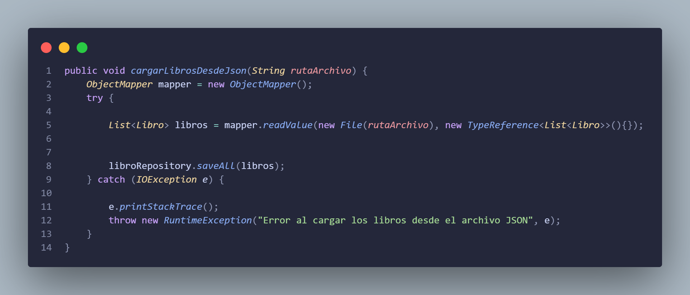

## Despliegue
Se hizo el despliegue con [azure app](https://azure.microsoft.com/es-es/products/app-service)

## Construido con 🛠️
* [Spring Initializer](https://start.spring.io)
* [Maven](https://maven.apache.org/)

## Colaboradores 🖋️
Santiago Diaz Rojas

Juan Sebastian Velasquez Rodriguez

David Felipe Velasquez Contreras

Santiago Alberto Naranjo Abril